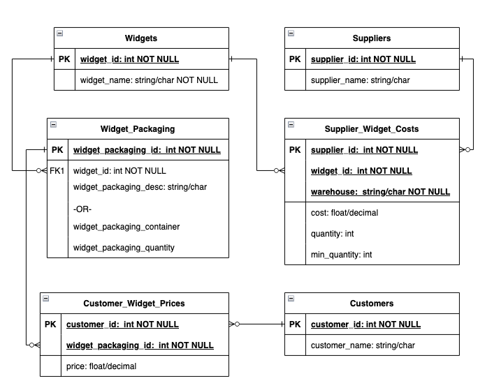

# Widgets Challenges
Create a basic system description and document a normalized schema from the 
attached widgets text file.  
Include
1) what you think this system does 
2) what you feel would be a reasonable database structure for the data,
3) a reasonable architecture for the system 
4) any questions or concerns you have regarding this dataset/system 
that might need to be answered before establishing an ideal 
database/solution for such a system

It's a very open-ended problem, and that's part of the problem.
# Answers
## 1. What this system does
This is likely an inventory management system for an outdoors/pest control, 
customer-facing store (as opposed to B2B).
Unfortunately, tracking multiple unique keys multiple times can lead to error.

## 2. Database Structure

The image above shows the relations and database structure I would propose 
based on the current number of records. Future improvements could include inventory tracking,
purchases by customer, etc.

### Widgets
| widget_id |   widget_name   |
|----------:|:---------------:|
|         1 |    Ant Trap     |
|         2 |   Mouse Trap    |
|         3 |    Bear Trap    |
|         4 |   Moose Trap    |
|         5 |  Elephant Trap  |

### Widget Packaging
|widget_package_id |widget_id |widget_package_desc*|widget_container**|widget_count_per_container**|
|-----------------:|---------:|:------------------:|:----------------:|---------------------------:|
|                1 |        1 |     bag of 10      |       bag        |                          10|
|                2 |        1 |      bag of 5      |       bag        |                           5|
|                3 |        2 |      box of 2      |       box        |                           2|
|                4 |        2 |      box of 1      |       box        |                           1|
|                5 |        2 |     bag of 10      |       bag        |                          10|
|                6 |        2 |      bag of 5      |       bag        |                           5|
|                7 |        3 |      box of 1      |       box        |                           1|
|                8 |        3 |      box of 5      |       box        |                           5|
|                9 |        4 |      box of 1      |       box        |                           1|
|               10 |        5 |     crate of 1     |      crate       |                           1|

### Suppliers
|  supplier_id | supplier_name |
|-------------:|:-------------:|
|            1 | Little Traps  |
|            2 |   Big Traps   |
|            3 |   Raytheon    |

### Supplier Widget Costs
|  supplier_id | warehouse  |  widget_id |   cost |  qty | min_qty |
|-------------:|:----------:|-----------:|-------:|-----:|--------:|
|            1 |    AUS     |          1 |   0.50 |  112 |      50 |
|            1 |    ATL     |          2 |   1.00 |  200 |      50 |
|            2 |    MSP     |          3 |  40.00 |   10 |      10 |
|            2 |    MSP     |          4 |  50.00 |    5 |       5 |
|            3 |    MSP     |          5 |  90.00 |    3 |       5 |

### Customers
|customer_id | customer_name |
|-----------:|:-------------:|
|          1 |  Home Place   |
|          2 |   Bug Store   |
|          3 | No Bears R Us |

### Customer Widget Prices
|widget_package_id |customer_id |price |
|-----------------:|-----------:|-----:|
|                1 |          1 |  9.00|
|                2 |          1 |  5.00|
|                1 |          2 | 10.00|
|                2 |          2 |  6.00|
|                3 |          1 |  5.00|
|                4 |          1 |  3.00|
|                5 |          1 | 20.00|
|                6 |          2 | 15.00|
|                7 |          1 | 50.00|
|                8 |          1 |220.00|
|                7 |          3 | 60.00|
|                9 |          1 | 75.00|
|                9 |          3 | 80.00|
|               10 |          1 |100.00|
|               10 |          3 |110.00|

## 3. Architecture
Given the number of records, the limited quantities, and the limited number of products,
a fairly simple API and possibly a CRUD GUI application with a standard
relational database would seem like a good fit. 

Additionally, given the seemingly limited use of this database (assuming it would not be accessed offsite),
the users/owners could choose to run this locally (with ongoing backups, of course).
Alternately, depending on the number of transactions occurring daily (my assumption for this
is that there are not many and they will not be happening simultaneously),
one option could be using AWS Lambdas with the HTTP API Gateway and an AWS-hosted
relational database. 

### Possible API Design
See linked HTML file for rough API design: [open file as html](./app/static/resources/api_design.html)

## 4. Questions/Concerns
Although I have listed my assumptions above, I'd like to know how many users will be updating 
data and if they will concurrently, the auth needed, and plans for expansion. Additionally, 
I would ask about the below:
* Are the warehouse string/codes always the same?
* Are the price/cost amounts in USD or other values?
* The supplier costs/quantities are confusing; it seems as though
from the table listed that boxes of 10 are the same prices as boxes of 1. 
That neither seems right nor is it good practice to store data like this.
* Have they considered using UPCs or other unique identifiers to track the quantity/packaging
type since boxes and crates are not specific and could change.
* How familiar the actual users of this system are with databases,
APIs, etc., to better tailor solutions to their technical level.
